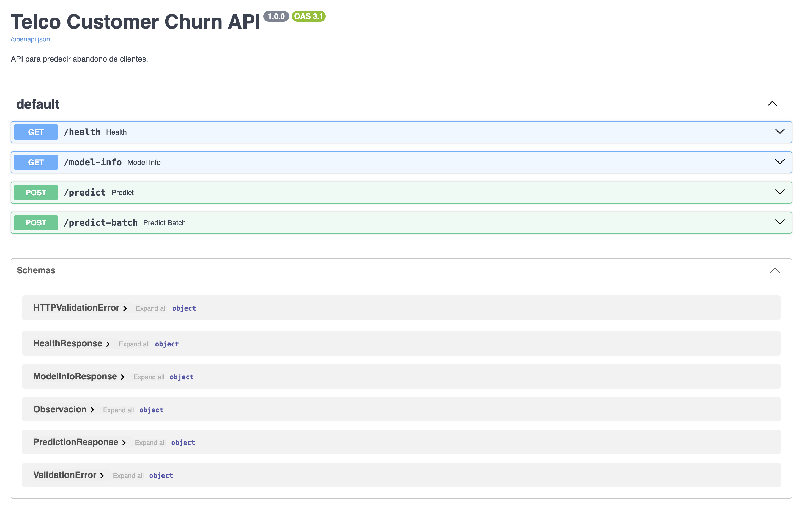
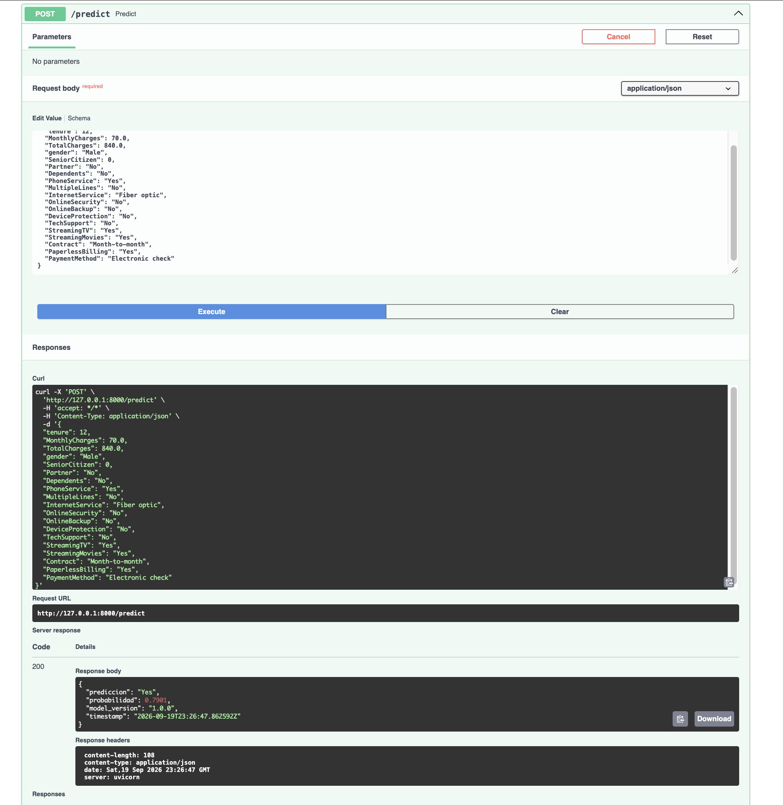
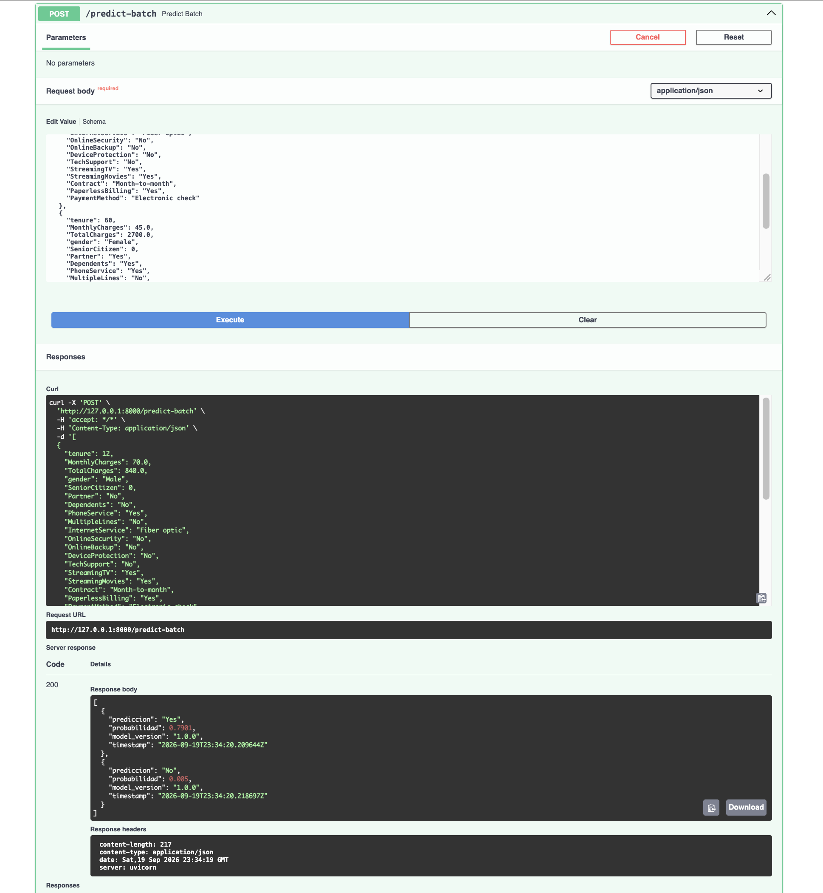
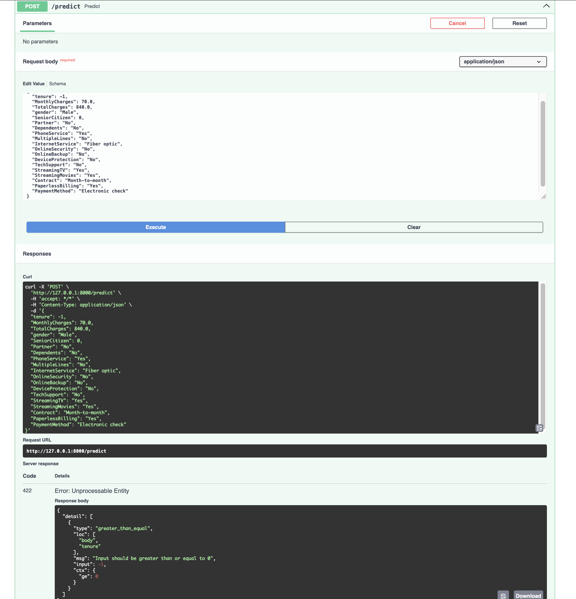

# Telco Customer Churn - FastAPI

Proyecto desarrollado para la asignatura **Cloud Computing para Data Science** del Diploma en Data Science de la Universidad Adolfo Ibáñez.

El objetivo del proyecto es entrenar un modelo de clasificación para predecir el abandono de clientes (`Churn`) y disponibilizarlo mediante una API construida con FastAPI.

**API desplegada:** https://cc-fastapi-churn.onrender.com

**Documentación Swagger:** https://cc-fastapi-churn.onrender.com/docs

## Dataset

Se utiliza el dataset público **IBM Telco Customer Churn**.

Fuente:  
https://github.com/IBM/telco-customer-churn-on-icp4d

La base contiene 7.043 clientes y 21 columnas. La variable objetivo es `Churn`, que indica si un cliente abandonó o no el servicio.

Para el modelamiento se excluye `customerID`, ya que corresponde únicamente a un identificador. Se utilizan 19 variables predictoras.

La distribución de la variable objetivo es:

- No: 5.174 clientes (73,46%)
- Yes: 1.869 clientes (26,54%)

El análisis exploratorio se encuentra en `notebooks/exploracion.ipynb`.

## Preparación y modelo

Durante la exploración se detectaron 11 valores vacíos en `TotalCharges`. Al cargar la base, estos espacios se interpretan como valores faltantes (`NaN`), que posteriormente son tratados dentro del pipeline de preprocesamiento.

El preprocesamiento considera:

- imputación por mediana para variables numéricas;
- escalado con `StandardScaler`;
- imputación por categoría más frecuente para variables categóricas;
- codificación mediante `OneHotEncoder`;
- tratamiento de `SeniorCitizen` como variable categórica.

El preprocesamiento y el modelo se integran en un único `Pipeline` de scikit-learn.

La imputación y el escalado se realizan dentro del pipeline para que las transformaciones se ajusten utilizando únicamente los datos de entrenamiento. Para las variables numéricas se utiliza la mediana, ya que es una medida robusta frente a valores extremos. Además, se aplica `StandardScaler` para trabajar las variables numéricas en una escala comparable antes de ajustar la regresión logística.

El modelo utilizado es una regresión logística (`LogisticRegression`).

La base se divide en 80% entrenamiento y 20% prueba, utilizando `random_state=42` y una separación estratificada según `Churn`.

Resultados obtenidos:

| Métrica | Resultado |
|  ----   |   ----   |
| Accuracy | 0.8055 |
| Precision | 0.6572 |
| Recall | 0.5588 |
| F1 | 0.6040 |
| ROC-AUC | 0.8419 |

El modelo alcanza un accuracy de 80,55% y un ROC-AUC de 0,8419. Debido al desbalance de la variable objetivo, el accuracy no se interpreta de forma aislada.

El recall de 0,5588 indica que, con el umbral de clasificación utilizado, el modelo identifica aproximadamente el 55,9% de los clientes que efectivamente presentan churn. Por otro lado, la precision de 0,6572 indica que aproximadamente el 65,7% de los clientes clasificados como churn corresponden efectivamente a esa clase.

Se utilizó una regresión logística porque permite mantener un modelo simple y reproducible, adecuado para el objetivo principal del trabajo: implementar correctamente el flujo desde el entrenamiento hasta el servicio de inferencia.

El pipeline entrenado se guarda en `model/model.pkl` y sus metadatos en `model/metadata.json`.

## Instalación

Clonar el repositorio:

```bash
git clone https://github.com/CristobalBr/cc_fastapi_churn.git
cd cc_fastapi_churn
```

Crear un entorno virtual con Python 3.11:

```bash
python3.11 -m venv .venv
```

Activar el entorno en macOS/Linux:

```bash
source .venv/bin/activate
```

Instalar las dependencias:

```bash
python -m pip install -r requirements.txt
```

La versión de Python utilizada en el proyecto es 3.11.16.

## Entrenamiento

Para volver a entrenar el modelo:

```bash
python train.py
```

El script carga los datos, realiza el preprocesamiento, entrena el modelo, calcula las métricas y genera nuevamente:

```text
model/model.pkl
model/metadata.json
```

## Ejecución local

Para iniciar la API:

```bash
python -m uvicorn app.main:app --reload --port 8000
```

Una vez iniciado el servidor, la documentación Swagger queda disponible en:

```text
http://127.0.0.1:8000/docs
```

## Endpoints

La API incluye los siguientes endpoints:

### GET `/health`

Permite comprobar que la aplicación está funcionando y que el modelo fue cargado correctamente.

Ejemplo de respuesta:

```json
{
  "status": "ok",
  "model_loaded": true,
  "model_version": "1.0.0"
}
```

### GET `/model-info`

Entrega información del modelo, incluyendo versión, variables utilizadas, métricas y versiones de Python y scikit-learn.

### POST `/predict`

Recibe los datos de un cliente y devuelve la predicción junto con la probabilidad de `Churn = Yes`.

Ejemplo de entrada:

```json
{
  "tenure": 12,
  "MonthlyCharges": 70.0,
  "TotalCharges": 840.0,
  "gender": "Male",
  "SeniorCitizen": 0,
  "Partner": "No",
  "Dependents": "No",
  "PhoneService": "Yes",
  "MultipleLines": "No",
  "InternetService": "Fiber optic",
  "OnlineSecurity": "No",
  "OnlineBackup": "No",
  "DeviceProtection": "No",
  "TechSupport": "No",
  "StreamingTV": "Yes",
  "StreamingMovies": "Yes",
  "Contract": "Month-to-month",
  "PaperlessBilling": "Yes",
  "PaymentMethod": "Electronic check"
}
```

Ejemplo de respuesta (campos principales):

```json
{
  "prediccion": "Yes",
  "probabilidad": 0.7901,
  "model_version": "1.0.0"
}
```
La respuesta incluye además una marca de tiempo (`timestamp`) en UTC.

### POST `/predict-batch`

Recibe una lista de clientes y devuelve una lista de predicciones en el mismo orden.

Las entradas son validadas con Pydantic. Por ejemplo, un valor inválido como `tenure = -1` genera una respuesta HTTP 422.

## Pruebas

Las pruebas automatizadas se encuentran en:

```text
tests/test_api.py
```

Para ejecutarlas:

```bash
python -m pytest -v
```

Las pruebas verifican:

- funcionamiento de `/health`;
- predicción individual;
- predicción por lote;
- validación de una entrada incorrecta.

Resultado obtenido:

```text
tests/test_api.py::test_health PASSED
tests/test_api.py::test_predict PASSED
tests/test_api.py::test_predict_batch PASSED
tests/test_api.py::test_predict_invalid_input PASSED

4 passed, 1 warning
```

## Evidencias

Las evidencias de ejecución local se encuentran en la carpeta `docs/`.

### Swagger



### Predicción individual



### Predicción por lote



### Validación de entrada incorrecta



## Despliegue en la nube

La API fue desplegada como un Web Service en Render.

URL pública:

https://cc-fastapi-churn.onrender.com

Documentación Swagger:

https://cc-fastapi-churn.onrender.com/docs

### Configuración

El servicio se conecta directamente al repositorio de GitHub y utiliza la rama `main`.

El comando de instalación utilizado es:

```bash
pip install -r requirements.txt

## Autor

Cristóbal Bravo